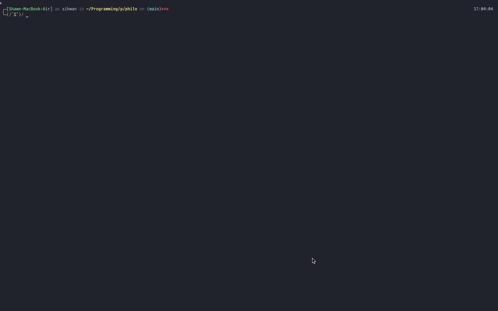
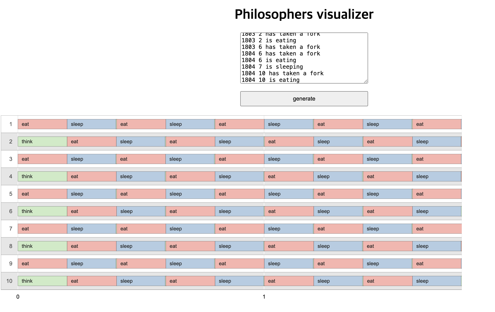
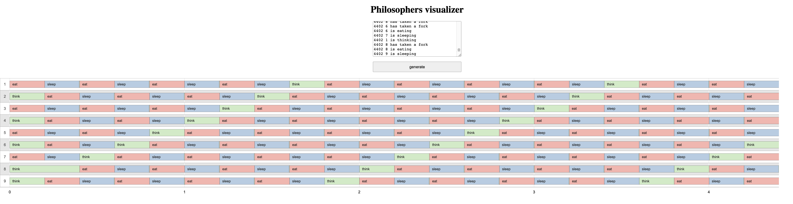

# Philosopher
philosopher problem using mutex, semaphore
모든 철학자가 먹고 자고 생각하는 동작을 하면서 굶어죽지 않게 동작을 관리하는 프로젝트.
mutex, semaphore를 활용한 멀티쓰레딩을 통해 각 쓰레드/프로세스들의 동작이 원활히 순환될 수 있게 하자.

# 프로젝트 조건
- Language : C
- Build : Makefile
- No leaks (Memory management)
- No global variables
- No data race
- 최소 입력 시간 60ms 이상.

# constraints
- 하나 이상의 철학자가 원탁에 앉는다.
- 원탁 중앙에 스파게티가 놓여있으며 이를 먹기 위해선 포크 두개를 양 손에 잡아야한다.
- 철학자는 순환적으로 먹고, 생각하거나 잔다(한 번에 한 동작만 가능)
- 포크는 철학자의 수 만큼 테이블에 올려져있다.
- 스파게티를 먹은 철학자는 포크를 내려두고 잔다. 일정 시간 수면 뒤 일어나서 생각하는 동작을 한다.
- 이 과정은 철학자 한 명이 굶어 죽기 전까지 반복한다.
- 모든 철학자는 먹어야하며 일정 시간 먹지 못해 굶어죽으면 안된다.
- 죽은 철학자 발생 시, 10ms 이내에 다잉 메시지를 출력하고 종료되어야 한다.

# usage
1. build

```
make 		 // for mandatory
make bonus	 // for bonus
```

2. executing
```
./philo [number_of_philosophers] [time_to_die] [time_to_eat] [time_to_sleep] ([number_of_times_each_philosopher_must_eat])
```

- number_of_philosophers: 철학자의 수
- time_to_die (in milliseconds): time_to_die 안에 먹기를 시작하지 않으면 철학자는 죽는다.
- time_to_eat (in milliseconds): 철학자가 먹는데 걸리는 시간
- time_to_sleep (in milliseconds): 철학자가 자는데 걸리는 시간
- number_of_times_each_philosopher_must_eat (optional argument): 모든 철학자가 해당 인자만큼 식사를 했다면 프로그램은 종료된다.

3. debug option
gcc compiler option : -fsanitize=thread

ex)
```
./philo 10 410 200 200 5
```



# Result
even case : 10명, 수명 410ms, 식사 200ms, 수면 200ms, 10 회 식사 


odd case : 199명, 810ms, 300ms, 300ms, 10회 

